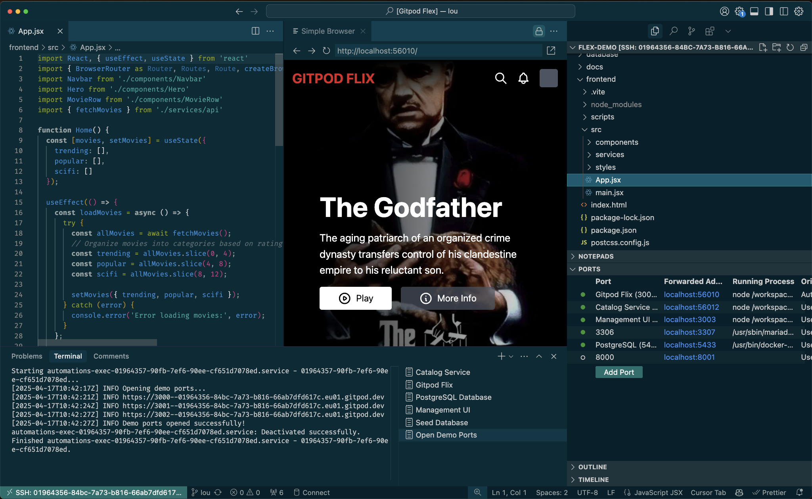

# Welcome to GitpodFlix! 🎬

Hey there, new team member! 👋

Welcome to GitpodFlix—providing the next generation of streaming experiences.

We're thrilled you joined. Let's get started on your first day.

### At GitpodFlix we ship to production on your first day

We know happy developers create better products. At GitpodFlix we have **zero "works on my machine" issues** because of Gitpod. Onboarding is one-click to get a running environment with everything you need to ship new fixes and features today.

That's why we want you to **ship to production today**.

Let's get started with shipping your first fix.

## Getting Started

1. **Check your email** - You should have an email invite to join the GitpodFlix organization in Gitpod as well as a link for your first GitHub issue.
2. **Go to the projects catalog at [app.gitpod.io/projects](https://app.gitpod.io/projects)** - Here you'll see a list of every project in the organization that you have access to.
3. **Open up GitpodFlix** - Search "GitpodFlix" in the list and click **"Create environment"** to launch your first development environment.

And bingo, you have your first environment up and running.


Here you have in your environment:

1. All your dependencies
2. The database running
3. The backend API running
4. Your web server started

## Making a code change

Now in the top right you can choose your favourite editor, whether that's IntelliJ, VS Code or even Cursor.


Your environment will automatically connect.



Here you have:

- All the source code in your favourite editor
- Your running web server on `localhost:3000`
- Your running ports for your API, database, etc
- All authenticated with your GitHub account
- A powerful environment secure in your corporate network

> **Tip:** Let's rename "Gitpod Flix" to our name by updating `frontend/src/components/Navbar.jsx`. Watch the web server live reload the change.

Now you're ready to code.

### Explore your development environment

Now you're setup why not explore:

1. Running a database clear and seed "automation" from the Gitpod UI
2. Connecting to your environment with the CLI `gitpod environment ssh`
3. Adding dotfiles for your personal preferences

## ✨ How does this magic work?

### Dev Container

All of the dependencies are defined in the `devcontainer.json` file. Your platform team has configured a base image with all of your platform tooling ready to go. Any time platform tooling updates the next environment you open will automatically have the latest tooling.

Here's a simplified version of how that looks:

```json
{
  "name": "GitpodFlix Dev Environment",
  "image": "mcr.microsoft.com/devcontainers/base:ubuntu",
  "features": {
    "ghcr.io/devcontainers/features/node:1": {},
    "ghcr.io/warrenbuckley/codespace-features/sqlite:1": {}
  },
  "forwardPorts": [
    3000,
    ...
  ],
  "postCreateCommand": ".devcontainer/setup.sh",
  "customizations": {
    "vscode": {
      "extensions": [
        "dbaeumer.vscode-eslint",
        ...
      ]
    }
  }
}
```

This includes:

1. Dependencies like SQLite and Node.JS
2. Configurations of ports to forward
3. A script for additional dependencies and setup
4. Customizations for your editor

### Automations

Your team have configured automations in `.gitpod/automations.yaml`.

Here's a simplified version of how that looks:

```yaml
services:
  catalog:
    name: "GitpodFlix Web Server"
    triggeredBy:
      - postEnvironmentStart
    commands:
      start: |
        cd /workspaces/flex-demo/frontend
        PORT=3001 npx nodemon src/index.ts

tasks:
  seedDatabase:
    name: "Seed Database"
    description: "Seed the database with sample movies in a dramatic sequence"
    triggeredBy:
      - manual
      - postEnvironmentStart
    command: |
      PGPASSWORD=gitpod psql -h localhost -U gitpod -d gitpodflix -f seeds/01_seed_trending.sql
```

This includes:

- Configurations to start your webservers, databases and microservices
- Automated tasks to seed your database, run tests, etc

All of these are setup to be self-serve and automatically configured. **If anything every breaks, simply delete your environment and create a new one.**

## FAQs

### Can I run multiple environment at once?

Yes.

### What happens if the environment stops?

Your code is saved—restart to continue working.

### How do I access logs for my running services?

Either:

1. In the editor "terminals" view
2. With the Gitpod CLI (inside or outside your environment)

### How do I customize my environment?

With dotfiles in your user profile.

### What if I need a new project?

Simply create a new one in the Gitpod UI.

### Can I connect via SSH?

Yes via the Gitpod CLI.

### How do I increase my machine size?

Projects are configured with a specific machine size that's perfect to use. Admins can update defauls or create a new project with a different size.
